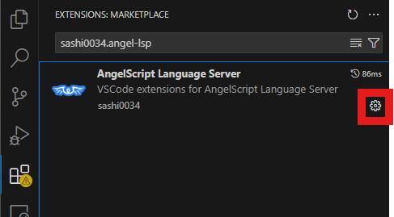

# User Settings

You can configure this extension by using the button shown in the image below.



Since AngelScript is a highly customizable language, you may need to adjust the settings according to your specific environment.

- Defining Built-in String Types
    - This can be configured using `Angel Script: Builtin String Types`. 
    This setting allows you to assign string literals in the form of `string s = "text"`. 
    The default values are: `string`, `String`.
  
    - If you do not use this setting, you can also make a class recognizable as a built-in string by adding the `BuiltinString` metadata to it.
    ```cpp
    [BuiltinString]
    class CustomString
    {
        // ...
    }
    ```

  
- Defining Built-in Array Type
  - This can be configured using `Angel Script: Builtin Array Type`.
  - This will handle `Type[]` as `array<Type>`.
  - Unlike Built-in String Types, the current version does not yet allow the Built-in Array Type to be set in the metadata


- Implicit Mutual Inclusion

    - This can be configured using `Angel Script: Implicit Mutual Inclusion`.
    - This setting is intended for users who compile all their AngelScript files into a single unit within their application. Think of it like compiling in C# or Java.
    - When enabled, this option implicitly imports other files without needing to use `#include`.
  